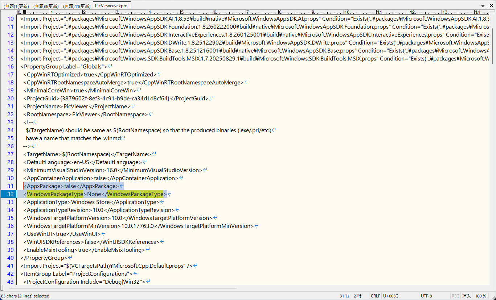
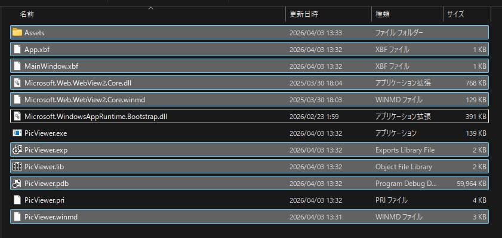
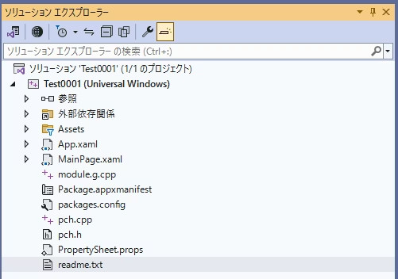
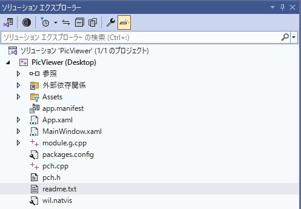
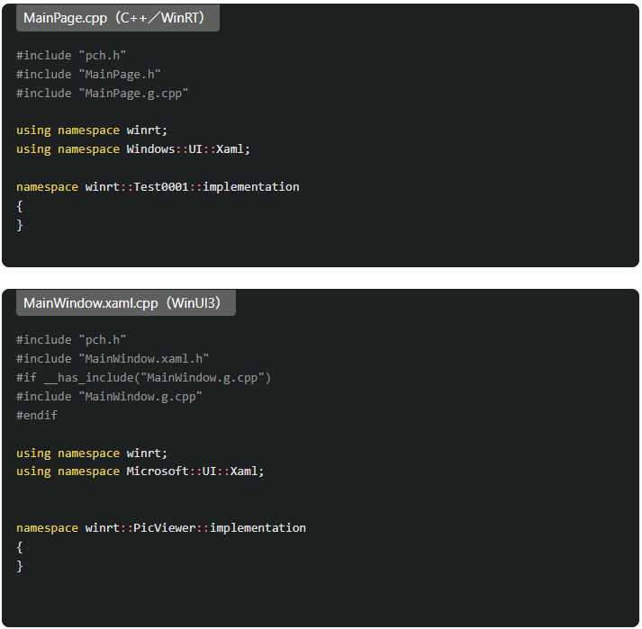
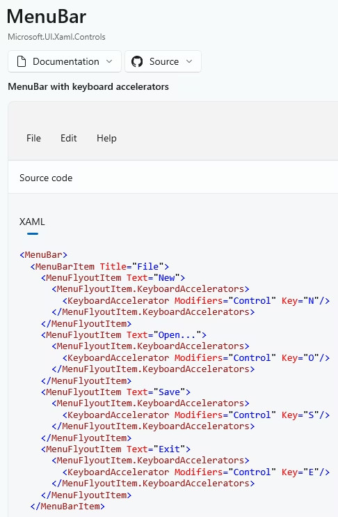

https://qiita.com/lilac0011/items/4e3e30bc78db7dd19b6f

# 1.创建工程
C++ / Windows / WinUI

WinUI Blank(Packaged)

Project name: PicViewer

# 2.创建不用安装也能运行的EXE
## 2.1 修改 .vcxproj文件
关闭VS，打开 .vcxproj文件 （eg. PicViewer.vcxproj)

找到   
<PropertyGroup Label="Globals">
    <AppxPackage>false</<AppxPackage>                                // 修改 true -> false
    <WindowsPackageType>None</WindowsPackageType>      // 添加

# 3.编译运行
 Build > Build Solution(F6)  编译Release版本

 复制 x64\Release\Picviewer目录到其他地方，留下以下3个文件，其他文件全部删除  
    ①PicViewer.exe  
　  ②PicViewer.pri  
　  ③Microsoft.WindowsAppRuntime.Bootstrap.dll  
  ✳ 可以运行


## 2.2 比较 WinUI3 vs C++/WinRT
### 2.2.1 文件构成
最大区别就是 C++/WinRT是 MainPage.xaml ；  
而WinUI3是 MainWindow.xaml  

·C++/WinRT  
  

·WinUI3  
  


### 2.2.2 Main.cpp
namespace的区别  
·C++/WinRT   winrt::Windows～  ；  
 WinUI3      winrt::Microsoft～  
 注意！！  另外还有 Microsoft::～的命名空间，用错命名空间的话会出错  

· 删掉 using namespace winrt;  
转而使用 winrt::Microsoft～  

·除了UI关联， 比较多的namespace是 winrt::Windows～，  
传给UI的时候错误地传给 Windows～的话会编译出错。  
  

# 3. 菜单File > Exit的确认对话框
## 3.1配置菜单栏
配置菜单栏的方法参考 WinUI3 Gallery。  
  

修改MainWindow文件。  

·添加菜单 File>Open , File>Exit  
·添加click事件，添加快捷键 Ctrl+O , Ctrl+E  

```xaml
MainWindow.xaml

<?xml version="1.0" encoding="utf-8"?>
<Window
    x:Class="PicViewer.MainWindow"
    xmlns="http://schemas.microsoft.com/winfx/2006/xaml/presentation"
    xmlns:x="http://schemas.microsoft.com/winfx/2006/xaml"
    xmlns:local="using:PicViewer"
    xmlns:d="http://schemas.microsoft.com/expression/blend/2008"
    xmlns:mc="http://schemas.openxmlformats.org/markup-compatibility/2006"
    mc:Ignorable="d"
    Title="PicViewer">

    <Grid RequestedTheme="Default">
        <Grid.RowDefinitions>
            <RowDefinition Height="auto"/>
        </Grid.RowDefinitions>

        <MenuBar Background="LightGray" BorderBrush="Black" BorderThickness="1" CornerRadius="5">
            <MenuBarItem Title="File">

                <MenuFlyoutItem Text="Open" Click="Open_Click">
                    <MenuFlyoutItem.KeyboardAccelerators>
                        <KeyboardAccelerator Modifiers="Control" Key="O"/>
                    </MenuFlyoutItem.KeyboardAccelerators>
                </MenuFlyoutItem>

                <MenuFlyoutItem Text="Exit" Click="Exit_Click">
                    <MenuFlyoutItem.KeyboardAccelerators>
                        <KeyboardAccelerator Modifiers="Control" Key="E"/>
                    </MenuFlyoutItem.KeyboardAccelerators
                </MenuFlyoutItem>
            </MenuBarItem>
        </MenuBar>
    </Grid>
</Window>
```
·MainWindow.xaml.h： 定义各个成员函数，构造函数里变更窗口标题。  
·Open_Click 先不写代码，返回值是void 。 Exit_Click返回值改成 IAsyncAction
·使用信息窗口或picker的时候需要取得HWND，故添加 getHwnd()函数。  

```C++
MainWindow.xaml.h

#pragma once

#include "MainWindow.g.h"

namespace winrt::PicViewer::implementation
{
    struct MainWindow : MainWindowT<MainWindow>
    {
        MainWindow()
        {
            // Xaml objects should not call InitializeComponent during construction.
            // See https://github.com/microsoft/cppwinrt/tree/master/nuget#initializecomponent
            // 变更标题
            this->Title(L"PicViewer");
        }

        // 取得HWND函数
        HWND getHwnd();

        int32_t MyProperty();
        void MyProperty(int32_t value);
    };
}

namespace winrt::PicViewer::factory_implementation
{
    struct MainWindow : MainWindowT<MainWindow, implementation::MainWindow>
    {
    };
}
```

·在 MainWindow.xaml.cpp里编写 getHwnd()与Exit_Click()函数。  
编写按下Exit菜单时弹出Yes, No, Cancel按钮的确认窗口。  
·只是表示对话框而已，为什么要 ContentDialog, MessageDialog 呢。。。  

```C++
MainWindow.xaml.cpp

#include "pch.h"
#include "MainWindow.xaml.h"
#if __has_include("MainWindow.g.cpp")
#include "MainWindow.g.cpp"
#endif

using namespace winrt;
using namespace Microsoft::UI::Xaml;

//::IWindowNativeと::IInitializeWithWindowを使うのにmicrosoft.ui.xaml.window.h、Shobjidl.hが必要
//MessageDialogを使うのにWindows.UI.Popups.hが必要
#include <microsoft.ui.xaml.window.h>
#include <winrt/Windows.UI.Popups.h>
#include <Shobjidl.h>

// To learn more about WinUI, the WinUI project structure,
// and more about our project templates, see: http://aka.ms/winui-project-info.

namespace winrt::PicViewer::implementation
{
    int32_t MainWindow::MyProperty()
    {
        throw hresult_not_implemented();
    }

    void MainWindow::MyProperty(int32_t /* value */)
    {
        throw hresult_not_implemented();
    }

    HWND MainWindow::getHwnd() {
        auto windowNative{ this->m_inner.as<::IWindowNative>() };
        HWND hWnd{ 0 };
        windowNative->get_WindowHandle(&hWnd);

        return hWnd;
    }

    void MainWindow::Open_Click(winrt::Windows::Foundation::IInspectable const& sender, winrt::Microsoft::UI::Xaml::RoutedEventArgs const& e)
    {

    }

    winrt::Windows::Foundation::IAsyncAction MainWindow::Exit_Click(winrt::Windows::Foundation::IInspectable const& sender, winrt::Microsoft::UI::Xaml::RoutedEventArgs const& e)
    {
        //ContentDialogはwinrt::Microsoft...となる。必要なのはXamlRoot
        Microsoft::UI::Xaml::Controls::ContentDialog isenddialog{};
        isenddialog.XamlRoot(this->Content().XamlRoot());
        isenddialog.Title(box_value(L"Do you want to close?"));
        isenddialog.PrimaryButtonText(L"Yes");
        isenddialog.SecondaryButtonText(L"No");
        isenddialog.CloseButtonText(L"Cancel");

        auto result = co_await isenddialog.ShowAsync();

        if (result == Microsoft::UI::Xaml::Controls::ContentDialogResult::Primary)
        {
            //アプリ終了
            Application::Current().Exit();
        }
        else if (result == Microsoft::UI::Xaml::Controls::ContentDialogResult::Secondary)
        {
            //MessageDialogはwinrt::Windows...となる。必要なのはHWND
            auto showdialog{ Windows::UI::Popups::MessageDialog(L"Continue without closing this application") };
            showdialog.as<::IInitializeWithWindow>()->Initialize(getHwnd());

            co_await showdialog.ShowAsync();
        }
    }

}//end namespace
```


