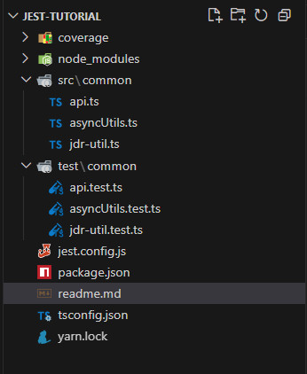

### 環境構築
#### 1. ツールインストール
- node.js  
    nvm list /  nvm list available  / nvm use 22.1.0  
- yarn  
- npm (nodejs同梱) or yarn
- typescript  

#### 2. インストール確認
```typescript
node -v
npm -v
```

#### 3. プロジェクト初期化
```typescript
mkdir JEST-TUTORIAL
cd JEST-TUTORIAL

// package.json作成
npm init -y

// typescriptと関連ツールをDEV環境インストール
npm install typescript @typescript/node --save-dev

// typescriptコンフィグファイル作成（tsconfig.json)
npx tsc --init
```

#### 4. tsconfig.jsonを編集
```json
// お勧め設定
{
  "compilerOptions": {
    "target": "es2016",                             
    /* Modules */
    "module": "commonjs",                           
    // "rootDir": "./src",                          
    // "moduleResolution": "node10",                
    // "baseUrl": "./",                             
    "rootDirs": ["./src", "./test"],              
    "declaration": true,                          
    "declarationMap": true,                       
    "sourceMap": true,                            
    "outDir": "./dist",                           
    "noEmitOnError": true,                        
    "esModuleInterop": true, 
    "forceConsistentCasingInFileNames": true,       

    "strict": true,                               
    "noImplicitAny": true,                        
    //"strictNullChecks": true,                     
    "strictFunctionTypes": true,                  
    "strictBindCallApply": true,                  
    //"strictPropertyInitialization": true,         
    "strictBuiltinIteratorReturn": true,          
    "noImplicitThis": true,                       
    "useUnknownInCatchVariables": true,           
    "alwaysStrict": true,                         
    "noUnusedLocals": true,                       
    "noUnusedParameters": true,                   
    //"exactOptionalPropertyTypes": true,           
    "noImplicitReturns": true,                    
    "noFallthroughCasesInSwitch": true,           
    "noUncheckedIndexedAccess": true,             
    "noImplicitOverride": true,                   
    "noPropertyAccessFromIndexSignature": true,   
    "allowUnusedLabels": true,                    
    "allowUnreachableCode": true,                 
    "skipLibCheck": true                            
  }
}
```

#### 5. jestと関連libをインストール
```typescript
// jest と typescriptサポートインストール
// 　ts-jest      jestでtypescriptを実行する依頼
//   @types/jest  自動コンフリクトサポート 
npm install jest ts-jest @types/jest --save-dev
yarn add -D "jest@latest" "ts-jest@latest" "@types/jest@latest"

// jest設定を初期化（jest.config.js)
npx ts-jest config:init

// jest.config.jsファイルが作成され、下記の中身を持つ
----------------------------------------------------------------
const { createDefaultPreset } = require("ts-jest");

const tsJestTransformCfg = createDefaultPreset().transform;

/** @type {import("jest").Config} **/
module.exports = {
  testEnvironment: "node",
  transform: {
    ...tsJestTransformCfg,
  },
};
----------------------------------------------------------------
```

#### 6. 作成済みプロジェクト構造  




### テスト実行
```typescript

// 全ての .test.tsを検索し、実行
npm jest --coverage

yarn jest

yarn dev

// 指定した api.test.tsだけ実行
yarn jest ./test/common/api.test.ts
```

### jestサンプル
#### describeのスコープ動作 (https://jestjs.io/docs/api#describe)
```javascript
// Jest特有のスコープ動作
describe("スコープの動作例", ()=>{
  let sharedVariable;

  beforeAll(()=>{
    console.log("外側のbeforeAll()");
  });

  beforeEach(()=>{
    sharedVariable = "initialized";
  });

  describe("ネストしたスコープ", ()=>{
    beforeEach(()=>{
      // 親のbeforEach()の後に実行される
      sharedVariable += " and extended";
    });

    test("should have access to modified variable", ()=>{
      expect(sharedVarialbe).toBe("initialized and extended");  // OK
    }); // end test
  }); // end describe

  afterEach(()=>{});

  afterAll(()=>{});

}); // end describe

```

## jest  axiosテスト
https://developer.baidu.com/article/details/3234039

```javascript
//axios.test.js

// 导入模拟的axios
import axios from "axios";

// 在每个测试之前重置axios的mock
beforeEach(() => {
  jest.resetModules();
  jest.mock("axios");
});

test("发送GET请求并验证响应", () => {
  // 模拟响应数据
  const mockResponse = {
    data:{
      name: "ABCD"
    }
  };

  // 模拟axios.get方法(mockResolveValue())
  axios.get.mockResolveValue(mockResponse);

  // 发送请求并验证相应
  const response = await axios.get("/aip/user");

  expect(response.data.name).toBe("ABCD");
})
```

## jest axios例外テスト
```typescript

test("发送GET请求并处理错误", async ()=>{
  // 模拟错误相应
  const mockError = new Error("network Error");

  // 模拟axios.get方法抛出错误(mockRejectedValue())
  axios.get.mockRejectedValue(mockError);

  try{
    await axios.get("/api/user");
  }catch(ex){
    expect(ex.message).toBe("network Error");
  }
})
```


*END*