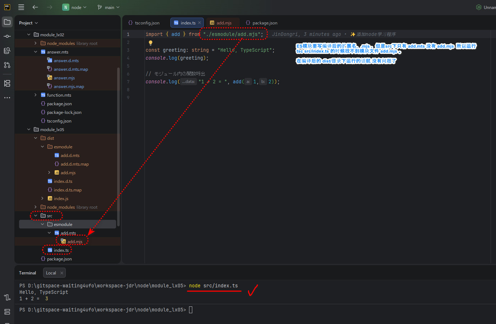

node 
--experimental-transform-types     enum支持 (node原生支持ts了，应不需要了)

main.ts

# 1.创建目录
mkdir module_lx005
cd module_lx005

npm init -y

# 2. 修改 package.json 
  "type": "commonjs" -> "module"

# 3.本地安装 TypeScript 
npm install --save-dev typescript

npx tsc --version

# 4.创建 TypeScript配置文件(tsconfig.json)
npx tsc --init

# 5.修改 tsconfig.json
{
  "compilerOptions":{
      "module": "nodenext",
      "target": "esnext",         // 古く設定されると(ES5等）、async/awaitなどが使用できない
      "strict": true                  // 型の不整合をより厳密に検出できる(hoverやred squiggleで警告される内容を見逃さないように）
  },
  "include": ["src"]              // include, exclude設定されないと、対象ファイルが読み込まれない
}

# 5.创建代码目录
mkdir src

# 6.创建代码文件 src/index.ts      
  // ESモジュール： .mts / .mjs    ;  commJS module:   .cts / .cjs 拡張子でしっかり分ける

  const greeting: string = "Hello, TypeScript!";
  console.log(greeting);#

# 7. 编译代码 自动参照tsconfig.json
 //in module_lx05 press the command.
npx tsc

# 8.运行编译后的 JavaScript代码
node dist/index.js

# 9. 開発ルーチンをスムーズにするために
・ tsc  -watch   自動でコンパイル
・ nodemon + ts-nodeを組み合わせて、開発体験を向上させることも可能

# 10.添加模块文件 src/esmodule/add.mts
  export function add(a: number, b: number): number{
    return a + b;
}

# 11. 修改src/index.ts (配置成ES模块， 这个.ts其实也被识别成 .mts)
  import { add } from "./esmodule/add.mjs";  // add.mtsでも、コンパイル後のファイル拡張子を指定するので .mjs 

# 12. 编译所有的TypeScript代码

npx tsc

    /dist
        |_esmodule
        |      |_add.mjs
        |
        |_index.js

# 13.执行编译后的JavaScript代码 （也可以直接执行TypeScript代码，但是参照下面的图片）
node  dist/index.js

-------------------------------------
Hello, TypeScript
1 + 2 =  3
-------------------------------------

✳ 关于ES模块的时候，用node（ver > 20）直接运行ts代码的问题
  

